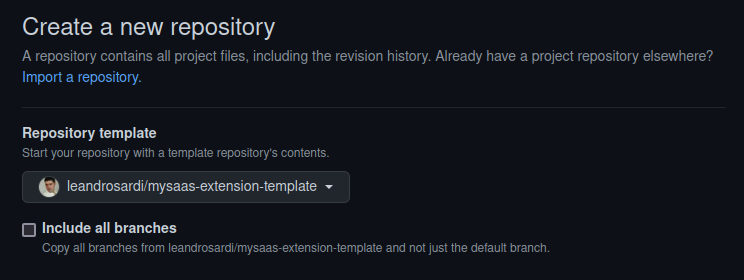

# mysaas-extension-template

This repository has all the files and folders you need to create a new extension of [MySaaS](https://github.com/leandrosardi/mysaas). 

When starting a new extension, fork this repository or use it as a template as well.
Reference: [https://deanmalone.net/post/how-to-fork-your-own-repo-on-github/](https://deanmalone.net/post/how-to-fork-your-own-repo-on-github/)

.

<!extension-description-here!>

## Getting Started

Just add the extension into the `config.rb` file of your [MySaaS](https://github.com/leandrosardi/mysaas) project.

```ruby
BlackStack::Extensions.append :<!your-github-repo-name-for-this-extension!>
```

## Disclaimer

The logo has been taken from [here](https://www.shareicon.net/chat-education-class-tutorial-speech-bubble-teacher-teaching-707418).